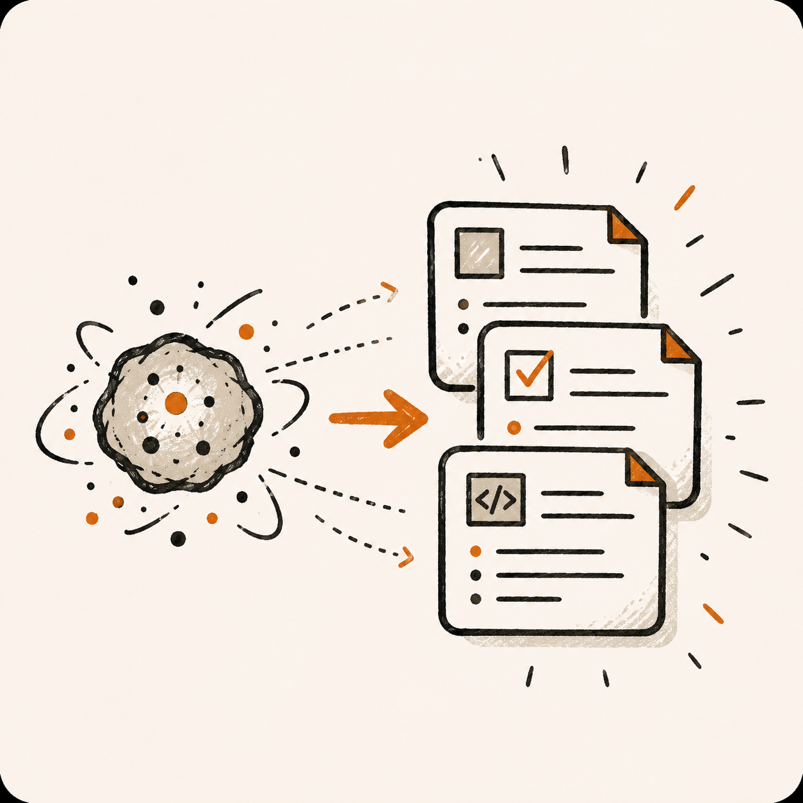

# vibe-forge

**Język / language:** [English](README.md) · [Polski](README.pl.md)

Na stronie głównej repozytorium GitHub domyślnie wyświetla `README.md`. Pełna wersja polska znajduje się w pliku [`README.pl.md`](README.pl.md).

<p align="center">
  
</p>

> Szablonowy framework startowy dla **vibe-coderów** — osób, które budują realne oprogramowanie z asystentami AI (Cursor, Claude Code, Codex, Lovable, Windsurf, Copilot, …), niekoniecznie będąc zawodowymi inżynierami oprogramowania.
>
> `vibe-forge` **nie dostarcza gotowego stosu technologicznego**. Dostarcza **strukturę, reguły oraz prowadzony wywiad startowy**, które uruchamiają projekt oparty o dowolny stos w stanie, w którym agenci AI mogą nad nim bezpiecznie pracować, dokumentacja pozostaje wiarygodna, a kod nie gnije po cichu w typowy „vibe-code’owy” bałagan.

<p align="center">
  
</p>

---

## Spis treści

1. [Czym jest (a czym nie jest)](#czym-jest-a-czym-nie-jest)
2. [Dla kogo to jest](#dla-kogo-to-jest)
3. [Dziewięciokrokowa ścieżka](#dziewięciokrokowa-ścieżka)
4. [Szybki start](#szybki-start)
5. [Atomic prompts](#atomic-prompts)
6. [Układ repozytorium](#układ-repozytorium)
7. [Obsługiwani agenci AI](#obsługiwani-agenci-ai)
8. [Filozofia dokumentacji](#filozofia-dokumentacji)
9. [Lista kontrolna po zakończeniu wywiadu](#lista-kontrolna-po-zakończeniu-wywiadu)
10. [Często zadawane pytania](#często-zadawane-pytania)
11. [Dziennik zmian frameworku](#dziennik-zmian-frameworku)
12. [Licencja](#licencja)

---

## Czym jest (a czym nie jest)

**`vibe-forge` to:**

- **Szablonowe repozytorium GitHub**, które klonujesz raz na każdy projekt.
- Zestaw **szablonów dokumentów** (`STATE.md`, `CHANGELOG.md`, `CLIENT_DOCS.md`, `PROJECT_MAP.md`, `RELEASE_NOTES.md`, `LESSONS.md` oraz nadrzędny `PROJECT_RULES.md`), które przetrwają każdą zmianę stosu.
- **Pętla samodoskonalenia** (`LESSONS.md`), która zapisuje każdy błąd i każdą korektę jako regułę prewencyjną, przeglądaną na początku każdej sesji agenta — tak, aby ten sam błąd nie powtórzył się drugi raz.
- Zestaw **plików reguł specyficznych dla narzędzi** (`.cursorrules`, `CLAUDE.md`, `AGENTS.md`, `.windsurfrules`, `copilot-instructions.md`, blok Lovable Project Knowledge) generowanych z jednego źródła prawdy.
- **Głęboko ustrukturyzowany prompt startowy** (`INIT_PROMPT_*.md`), który prowadzi z Tobą wywiad w Twoim języku i na końcu tworzy dopasowany szkielet projektu.
- **Dołączoną umiejętność `/atomic-prompts`**, która zamienia jednozdaniowy pomysł w wysokiej jakości, w pełni skontekstualizowany plik promptu, który możesz uruchomić w dowolnym narzędziu.

**`vibe-forge` to NIE:**

- Gotowy stos. Nie narzuca Reacta, Vue, Supabase, Firebase, Next.js ani niczego innego. Wywiad wybiera za Ciebie albo wspólnie z Tobą.
- Generator działający bez Ciebie. To model językowy prowadzi rozmowę; Ty odpowiadasz na pytania; pliki się pojawiają.
- Produkt wersjonowany semantycznie (jeszcze). Klonuj gałąź `main` — to jest framework. Historię zmian znajdziesz w sekcji [Dziennik zmian frameworku](#dziennik-zmian-frameworku).
- Zamiennik myślenia. Narzuca porządek, ale nie napisze specyfikacji produktu za Ciebie — choć potrafi Cię **dokładnie wypytać**, aż ją dostarczysz.

---

## Dla kogo to jest

Powinieneś lub powinnaś skorzystać z `vibe-forge`, jeśli **przynajmniej jedno** z poniższych stwierdzeń jest prawdziwe:

- Zaczynasz nowy projekt z pomocą AI i chcesz, aby **przetrwał etap proof of concept**.
- Nie jesteś starszym inżynierem i boisz się skończyć z kodem, po którym — nawet Twój asystent AI — nikt nie potrafi się połapać.
- Chcesz mieć **dokument gotowy do przekazania klientowi** (`CLIENT_DOCS.md`) na każdym etapie projektu.
- Jesteś niezależny od narzędzia albo podejrzewasz, że w trakcie projektu **będziesz przechodzić między Cursorem / Claude Code / Codexem / Lovabledem / Windsurfem / Copilotem**.
- Nie znosisz momentu, w którym asystent AI „zapomina”, o czym jest projekt, bo **nie ma kanonicznego miejsca**, do którego można zajrzeć.

Jeśli jesteś inżynierem z mocnymi opiniami i zwartym stosem, nadal możesz z tego skorzystać — po prostu usuń po wywiadzie to, czego nie potrzebujesz.

---

## Dziewięciokrokowa ścieżka

<p align="center">
  
</p>

Tak wygląda zamierzona podróż użytkownika od początku do końca:

1. Otwierasz to repozytorium na GitHubie i czytasz README.
2. Przeglądasz folder [docs/](docs/), jeśli chcesz zrozumieć *dlaczego* tak to zaprojektowano.
3. **Klonujesz** repozytorium na swój komputer i zmieniasz nazwę folderu na nazwę projektu.
4. **Otwierasz sklonowany folder** w wybranym narzędziu AI (Cursor, Claude Code, Codex, …) i wklejasz do czatu jeden z plików `INIT_PROMPT_*.md`. Prompt sprawdza, czy działa wewnątrz klona `vibe-forge` (za pomocą pliku sygnalizacyjnego `.vibe-forge-root`). Jeśli katalog roboczy jest niewłaściwy, przerywa i prosi o poprawienie ścieżki.
5. Model **przeprowadza z Tobą wywiad** — w Twoim języku — o stos, design, domenę biznesową, bezpieczeństwo, grupę docelową, wdrożenie, narzędzia itd. W dowolnym momencie możesz odpowiedzieć:
   - jedną z opcji wielokrotnego wyboru zaproponowanych przez model,
   - **własną odpowiedzią swobodną**,
   - **opcją E („niech zdecyduje model”)** dla pojedynczego pytania albo
   - poleceniem **`/skip-section`**, aby model wypełnił resztę sekcji najlepszymi zgadywaniami (prompt wymaga dwuetapowego potwierdzenia, żeby nie uruchomić tego przypadkowo).
6. Gdy wywiad się kończy, model **wypełnia każdy szablon** w `templates/` Twoimi odpowiedziami, przenosi je do katalogu głównego projektu, usuwa pozostałości szkieletu i zapisuje pierwsze wpisy w `CHANGELOG.md`, `STATE.md`, `CLIENT_DOCS.md`, `PROJECT_MAP.md`, `RELEASE_NOTES.md`, `LESSONS.md`. Jeśli o to poprosisz, przygotuje też prowadzone „jak działa ten projekt”, które możesz przekazać osobie nietechnicznej.
7. **Wracasz do zwykłego promptowania** w swoim narzędziu. Wygenerowane `.cursorrules` / `CLAUDE.md` / `AGENTS.md` / … kierują każdą kolejną sesję agenta najpierw do `PROJECT_MAP.md`, więc przeładowanie kontekstu to **jeden plik**, a nie całe repozytorium.
8. Gdy chcesz nową funkcję albo zmianę, możesz wywołać umiejętność **`/atomic-prompts`** (patrz niżej). Zamienia luźny pomysł w w pełni skontekstualizowany plik promptu w `atomic-prompts/`, który potem uruchomisz w tym samym albo innym narzędziu.
9. Śpisz spokojnie. Dokumentacja jest zsynchronizowana, historia liniowa, klient ma co czytać, a AI ma się do czego oprzeć.

---

## Szybki start

```bash
# 1. Sklonuj framework (zmień nazwę folderu na swoją nazwę projektu)
git clone https://github.com/<twoj-fork-lub-organizacja>/vibe-forge.git moj-projekt
cd moj-projekt

# 2. (Opcjonalnie) Usuń historię gita vibe-forge, żeby powstało świeże repozytorium
rm -rf .git
git init

# 3. Otwórz folder w preferowanym narzędziu AI, a następnie wklej JEDEN z plików:
#    - INIT_PROMPT_short.md      (~10 pytań, najszybciej, głównie domyślne ustawienia modelu)
#    - INIT_PROMPT_standard.md   (~30 pytań, zalecane dla większości projektów)
#    - INIT_PROMPT_deep.md       (60+ pytań, wywiad w stylu audytowym)

# 4. Odpowiadaj na pytania. Używaj opcji E albo /skip-section, gdy
#    nie znasz odpowiedzi albo nie masz preferencji.

# 5. Po zakończeniu wywiadu wykonaj listę kontrolną sprzątania
#    wypisaną na końcu ostatniej wiadomości promptu.
```

> **Wskazówka:** Uruchom wywiad w *świeżej* sesji czatu swojego narzędzia AI, ze sklonowanym folderem jako katalogiem głównym workspace’u. Nie wklejaj promptu w długą, niepowiązaną rozmowę — opiera się na czystym kontekście.

---

## Atomic prompts

<p align="center">
  
</p>

To jeden z dwóch powodów, dla których istnieje `vibe-forge` (drugi to wywiad). W edytorach zwykle wywołujesz ją jako `/atomic-prompts`.

**Co robi.** Podajesz modelowi zdanie w stylu:

> „Dodaj logowanie Google do ekranu uwierzytelniania.”

…a on tworzy kompletny, samowystarczalny plik promptu w `atomic-prompts/NNNN-add-google-login-to-auth-screen.md`, ustrukturyzowany tak, jak napisałby go starszy inżynier w zgłoszeniu: kontekst, kryteria akceptacji, pliki do zmiany, przypadki brzegowe, testy, notatki o wycofaniu zmian, odniesienia do `PROJECT_MAP.md` i `STATE.md`. Ten plik zostaje z Tobą na zawsze — możesz go ponownie uruchomić, porównać diffem, udostępnić albo jutro wykonać w innym narzędziu.

Umiejętność jest dostępna w trzech wariantach w folderze `skills/`:

- `skills/cursor/.cursor/commands/atomic-prompts.md` — polecenie po ukośniku w Cursorze.
- `skills/claude-code/.claude/skills/atomic-prompts/SKILL.md` — umiejętność w Claude Code.
- `skills/codex/.codex/skills/atomic-prompts/SKILL.md` — umiejętność w Codexie.

W trakcie wywiadu prompt zapyta, z jakich narzędzi korzystasz, i **zainstaluje właściwe warianty w katalogu głównym projektu** (oraz podpowie, jak zainstalować je globalnie, jeśli wolisz). Po instalacji działa którykolwiek z poniższych wzorów:

```text
/atomic-prompts Add Google login to the auth screen
```
```text
Use the atomic-prompts skill for: "Add Google login to the auth screen"
```
```text
Run /atomic-prompts on this idea: dark-mode toggle in the settings page
```

Struktura wyjścia opiera się na sprawdzonym formacie używanym w realnych promptach atomowych (pełny schemat i przykłady w pliku `docs/PROMPT_AUTHORING_GUIDE.md`).

---

## Układ repozytorium

```text
vibe-forge/
├── README.md                        ← jesteś tu (wersja angielska)
├── README.pl.md                     ← pełne polskie README
├── .vibe-forge-root                 ← plik sygnalizacyjny; INIT_PROMPT nie uruchomi się bez niego
├── .gitignore                       ← minimalna baza; rozszerzana po wywiadzie
├── .env.example                     ← placeholder; zastępowany po wywiadzie
│
├── INIT_PROMPT_short.md             ← wywiad, ~10 pytań
├── INIT_PROMPT_standard.md          ← wywiad, ~30 pytań (zalecane)
├── INIT_PROMPT_deep.md              ← wywiad, 60+ pytań
│
├── docs/                            ← dokumentacja samego frameworku
│   ├── assets/
│   │   └── readme/                  ← grafiki README i ilustracje marki
│   │       ├── main.png
│   │       ├── banner-hero.png
│   │       ├── guided-interview.png
│   │       ├── atomic-prompts.png
│   │       └── documentation-discipline.png
│   ├── HOW_IT_WORKS.md
│   ├── INTERVIEW_PHILOSOPHY.md
│   ├── PROMPT_AUTHORING_GUIDE.md
│   └── FRAMEWORK_CHANGELOG.md
│
├── templates/                       ← zużywane przez INIT_PROMPT, usuwane potem
│   ├── project-docs/                ← szablony dokumentów projektowych
│   │   ├── STATE.md.template
│   │   ├── CHANGELOG.md.template
│   │   ├── CLIENT_DOCS.md.template
│   │   ├── PROJECT_MAP.md.template
│   │   ├── RELEASE_NOTES.md.template
│   │   └── LESSONS.md.template
│   ├── project-rules/               ← szablony reguł projektowych
│   │   ├── PROJECT_RULES.md.template       ← NADRZĘDNE źródło prawdy
│   │   ├── CODING_RULES.md.template
│   │   ├── DESIGN.md.template
│   │   ├── PRODUCT.md.template
│   │   ├── DATABASE.md.template
│   │   └── DEPLOYMENT.md.template
│   ├── agent-configs/               ← pliki reguł pod konkretne narzędzia (z PROJECT_RULES)
│   │   ├── cursor/        (.cursorrules.template, .cursor/rules/*)
│   │   ├── claude-code/   (CLAUDE.md.template)
│   │   ├── codex/         (AGENTS.md.template)
│   │   ├── windsurf/      (.windsurfrules.template)
│   │   ├── copilot/       (.github/copilot-instructions.md.template)
│   │   └── lovable/       (LOVABLE_PROJECT_KNOWLEDGE.md.template)
│   └── env-examples/                ← warianty .env.example pod konkretne stosy
│       ├── supabase.env.example
│       ├── firebase.env.example
│       ├── postgres.env.example
│       └── vercel.env.example
│
└── skills/                          ← umiejętność /atomic-prompts, kilka wariantów
    ├── README.md                    ← instrukcje instalacji
    ├── cursor/.cursor/commands/atomic-prompts.md
    ├── claude-code/.claude/skills/atomic-prompts/SKILL.md
    └── codex/.codex/skills/atomic-prompts/SKILL.md
```

Po zakończeniu wywiadu:

- folder `templates/` jest **usuwany** (albo archiwizowany w `.vibe-forge/used/`, jeśli się na to zdecydujesz),
- pliki `INIT_PROMPT_*.md` są **usuwane** (zawsze możesz je odzyskać z tego repozytorium),
- plik `.vibe-forge-root` jest **usuwany**,
- folder `docs/` **zostaje**, jeśli chcesz zachować dokumentację frameworku; w przeciwnym razie jest **usuwany** — decyzja podczas wywiadu,
- wszystkie sześć plików `templates/project-docs/*.template` staje się rzeczywistymi plikami w katalogu głównym projektu.

---

## Obsługiwani agenci AI

`vibe-forge` jest **z założenia niezależny od narzędzia**. Wywiad wykrywa, z czego korzystasz, i zapisuje odpowiednie pliki reguł. Obecnie framework dostarcza szablony pierwszej klasy dla:

| Narzędzie      | Generowany plik                                   | Uwagi                                              |
| -------------- | ------------------------------------------------- | -------------------------------------------------- |
| Cursor         | `.cursorrules`, `.cursor/rules/*.mdc`            | Zawiera polecenie po ukośniku `/atomic-prompts`.   |
| Claude Code    | `CLAUDE.md`, `.claude/skills/atomic-prompts/`     | Format umiejętności zgodny ze specyfikacją Anthropic. |
| Codex CLI      | `AGENTS.md`, `.codex/skills/atomic-prompts/`     | Umiejętność zarejestrowana w Codexie.              |
| Windsurf       | `.windsurfrules`                                  | Odzwierciedla `PROJECT_RULES.md`.                  |
| GitHub Copilot | `.github/copilot-instructions.md`               | Pod instrukcje repozytorium w Copilocie.            |
| Lovable        | blok Lovable Project Knowledge (gotowy do wklejenia) | Generowany z `PROJECT_RULES.md`.              |

Jeśli Twojego narzędzia nie ma na liście, nadrzędny `PROJECT_RULES.md` i tak daje Ci około 95% tego, czego potrzebujesz — możesz go wkleić w pole „system prompt” / „niestandardowe instrukcje”.

---

## Filozofia dokumentacji

<p align="center">
  
</p>

`vibe-forge` wymusza **sześć oddzielnych plików dokumentacji** w katalogu głównym projektu; każdy ma **jedno** zadanie i tylko jedno:

| Plik               | Odbiorcy          | Zasada aktualizacji                               |
| ------------------ | ----------------- | ------------------------------------------------- |
| `STATE.md`         | model + deweloper | **Nadpisywany** — tylko aktualna prawda, bez historii. Usunięta funkcja znika stąd. |
| `CHANGELOG.md`     | deweloper + Ty z przyszłości | **Tylko dopisywanie** — liniowa historia. Każda istotna zmiana to nowy wpis. Bez retuszowania przeszłości. |
| `CLIENT_DOCS.md`   | klient końcowy    | Prosty język, nietechniczny. Aktualizowany przy zmianie zachowania produktu. Bezpieczny do przekazania w każdej chwili. |
| `PROJECT_MAP.md`   | model (głównie)   | Zwięzła, mechaniczna mapa plików / modułów / źródeł prawdy. Pierwszy plik, do którego prowadzą reguły agenta. |
| `RELEASE_NOTES.md` | mieszany / publiczny | Notatki per wersja z perspektywy użytkownika. Powstają z `CHANGELOG.md` przy wydaniu. |
| `LESSONS.md`       | model + deweloper | **Dopisywany po każdej korekcie.** Każdy wpis: wzorzec, przyczyna źródłowa, reguła prewencyjna. Przeglądany na starcie sesji. Wpisy „dojrzewają” do stałych plików reguł, gdy się potwierdzą. |

Oraz pliki reguł:

| Plik               | Przeznaczenie                                                                 |
| ------------------ | ----------------------------------------------------------------------------- |
| `PROJECT_RULES.md` | Nadrzędne źródło prawdy, niezależne od narzędzia. Z niego pochodzą pozostałe pliki reguł. |
| `CODING_RULES.md`  | Reguły na poziomie kodu (JSDoc, obsługa błędów, bezpieczeństwo, nazewnictwo itd.). |
| `DESIGN.md`        | System designu, kolory, typografia, komponenty, ruch, dostępność.            |
| `PRODUCT.md`       | Czym jest produkt, komu służy, co musi robić.                                 |
| `DATABASE.md`      | Schemat, polityka migracji, reguły RLS / bezpieczeństwa, typy wyliczeniowe.   |
| `DEPLOYMENT.md`    | Hosting, środowiska, polityka sekretów, instrukcje operacyjne.               |

Długie uzasadnienie podziału znajdziesz w [`docs/HOW_IT_WORKS.md`](docs/HOW_IT_WORKS.md).

---

## Lista kontrolna po zakończeniu wywiadu

Ostatnia wiadomość każdego pliku `INIT_PROMPT_*.md` kończy się tą listą. Powtarzamy ją tutaj, żebyś mógł lub mogła szybko zweryfikować wynik:

- [ ] W katalogu głównym projektu istnieją `STATE.md`, `CHANGELOG.md`, `CLIENT_DOCS.md`, `PROJECT_MAP.md`, `RELEASE_NOTES.md`, `LESSONS.md` z treścią.
- [ ] Istnieje `PROJECT_RULES.md` z wybranym stosem, polityką językową i linią bazową bezpieczeństwa.
- [ ] Dla każdego narzędzia, z którego korzystasz, istnieje co najmniej jeden pasujący plik reguł (`.cursorrules`, `CLAUDE.md`, `AGENTS.md` itd.).
- [ ] `.env.example` odzwierciedla wybrany stos (Supabase / Firebase / Postgres / Vercel / własny).
- [ ] `.gitignore` został rozszerzony o wpisy specyficzne dla stosu.
- [ ] Folder `atomic-prompts/` istnieje (pusty też w porządku), a umiejętność `/atomic-prompts` jest zainstalowana dla co najmniej jednego narzędzia.
- [ ] `templates/`, pliki `INIT_PROMPT_*.md` oraz `.vibe-forge-root` zostały usunięte (albo przeniesione do `.vibe-forge/used/`).
- [ ] `git status` pokazuje wyłącznie pliki, których się spodziewasz.

---

## Często zadawane pytania

**P: Czy mogę uruchomić wywiad drugi raz?**  
**O:** Tak, ale jest to destrukcyjne — jeśli chcesz zacząć od zera, sklonuj framework do świeżego folderu. Nie ma formalnej ścieżki aktualizacji między wersjami frameworku.

**P: Dlaczego framework nie ma numeracji semver?**  
**O:** Bo nie ma „aktualizacji w miejscu” — każdy projekt powstaje ze zrzutu `main` w momencie klonowania. Historia samego frameworku jest w [`docs/FRAMEWORK_CHANGELOG.md`](docs/FRAMEWORK_CHANGELOG.md). Jeśli chcesz zamrożoną wersję, zrób fork albo tag na commicie, z którego klonowałeś.

**P: W jakim języku jest wywiad?**  
**O:** Wykrywa język Twojej pierwszej odpowiedzi i kontynuuje w tym języku. README i szkielet szablonów są po angielsku; *wygenerowana* dokumentacja (`.md`) domyślnie przyjmuje język potwierdzony podczas wywiadu. Komentarze w kodzie domyślnie po angielsku — możesz to nadpisać.

**P: Co jeśli w moim narzędziu nie ma `askUserQuestion`?**  
**O:** Prompt automatycznie przechodzi na ponumerowane pytania Markdown z czterema opcjami (A / B / C / D), gdzie D to zawsze „moja własna odpowiedź (swobodna)”.

**P: Co jeśli nie znam odpowiedzi na pytanie o design albo kod?**  
**O:** Wybierz **opcję E („niech zdecyduje model”)** dla tego jednego pytania albo wywołaj **`/skip-section`**, by model wypełnił resztę sekcji. Oba warianty wymagają potwierdzenia, więc nie uruchomisz ich przypadkowo.

**P: Czy mogę później dodać kolejne narzędzia agenta?**  
**O:** Tak. `PROJECT_RULES.md` jest jedynym źródłem prawdy; Ty (albo Twój asystent AI) możecie w każdej chwili wyprowadzić z niego nowe pliki pod inne narzędzia.

---

## Dziennik zmian frameworku

> To jest dziennik zmian samego `vibe-forge` — nie Twojego projektu. Twój projekt dostaje własny `CHANGELOG.md` generowany podczas wywiadu.
>
> Szczegółowe wpisy znajdują się w [`docs/FRAMEWORK_CHANGELOG.md`](docs/FRAMEWORK_CHANGELOG.md). Najnowsze wpisy są tutaj skrótowo dla wygody.

### Unreleased

- Pierwszy publiczny szkielet:
  - trzy warianty `INIT_PROMPT_*.md` (short / standard / deep),
  - sześć szablonów dokumentów projektowych (w tym pętlę samodoskonalenia `LESSONS.md`) oraz sześć szablonów reguł,
  - szablony konfiguracji agentów dla Cursora, Claude Code, Codexa, Windsurfa, Copilota i Lovableda,
  - umiejętność `/atomic-prompts` w wariantach Cursor, Claude Code i Codex,
  - sprawdzanie ścieżki plikiem sygnalizacyjnym, hybrydowa interakcja wywiadu (`askUserQuestion` + ponumerowany fallback, opcja E + `/skip-section`),
- dokumentacja zsynchronizowana z `LESSONS.md`: [`docs/FRAMEWORK_CHANGELOG.md`](docs/FRAMEWORK_CHANGELOG.md), [`docs/HOW_IT_WORKS.md`](docs/HOW_IT_WORKS.md), [`docs/PROMPT_AUTHORING_GUIDE.md`](docs/PROMPT_AUTHORING_GUIDE.md).

---

## Licencja

MIT, chyba że zrobisz fork i postanowisz inaczej. Jeśli plik `LICENSE` jest w repozytorium, patrz tam — w przeciwnym razie przyjmij MIT.
